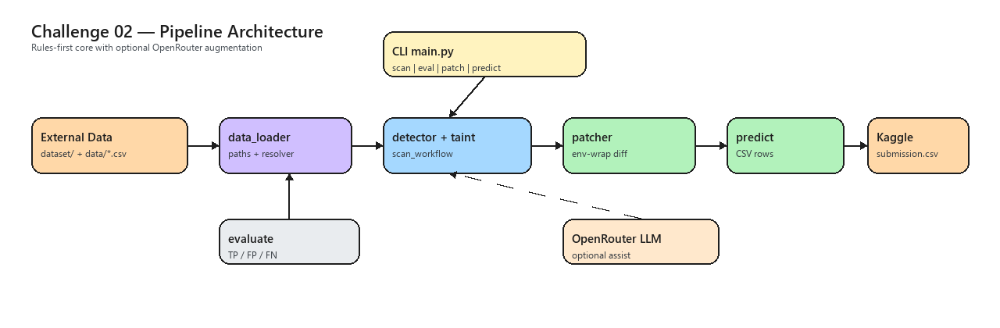

# GSC 2026 — Challenge 02: GitHub Actions Vulnerability Detection

IEEE Global Student Challenge — detect code-injection flaws in GitHub Actions workflows and generate secure patches.

## Problem

GitHub Actions workflows can be vulnerable when **untrusted inputs** (branch names, PR titles, issue text, etc.) are interpolated directly into `run:` shell commands. Attackers can inject arbitrary shell code.

This project loads competition samples, scans workflow YAML for risky patterns, generates env-wrap patches, and produces Kaggle submission CSV rows.

## Architecture



*Excalidraw-style diagram — editable source: [`docs/architecture.excalidraw`](docs/architecture.excalidraw)*

```text
External Data → data_loader → resolver → detector+taint → patcher → predict → Kaggle CSV
                              ↑              ↑ optional OpenRouter (--use-llm)
                         CLI (main.py)   evaluate (train metrics)
```

## Phase I progress check-in (2026-07-26)

| Item | Status |
|------|--------|
| Rule-based detector + taint tracking | Done |
| Patch generation (env-wrap + unified diff) | Done |
| Predict / submission CSV pipeline | Done |
| Unit + integration tests | 28 passing |
| Train metrics | TP=22, FP=0, FN=7 (~76% recall) |
| Kaggle validation workflows | Pending (Kaggle data compression) |

**Pipeline:** `scan` → `eval` → `patch` → `predict`

**Kaggle:** Upload `output/submission_train.csv` for Phase I checkpoint; re-run `predict --split validation` once validation workflows are available.

## Data setup

1. Clone the competition dataset (do not commit this folder):

   ```bash
   git clone https://github.com/XinyuZhangXvX/detect-and-fix-vulnerabilities-in-github-actions.git dataset
   ```

2. Download from [Kaggle Data tab](https://www.kaggle.com/competitions/detect-and-fix-vulnerabilities-in-github-actions/data) into `data/`:
   - `train.csv` — sample IDs and ground-truth labels
   - `untrusted_data.csv` — list of untrusted GitHub context expressions

3. When available, place validation workflow YAML files in `dataset/validation/workflows/`.

## Project layout

```text
GSC2/
  data/           # CSV metadata from Kaggle
  dataset/        # Cloned competition repo (gitignored)
  src/            # detector, taint, patcher, predict, llm, eval
  tests/
  docs/adr/
  output/         # Generated patches and submission CSV (gitignored)
  requirements.txt
```

## Quick start

```bash
python -m venv .venv
.venv\Scripts\activate        # Windows
pip install -r requirements.txt

# Scan first 10 training samples
python -m src.main scan

# Inspect one known vulnerable sample
python -m src.main scan --sample-id 63dd948580aa29a6fd4868f5

# Evaluate all 150 training samples (metrics summary)
python -m src.main eval --full
```

## Testing

```bash
pytest                          # unit + integration (integration skips without dataset)
python -m src.main eval --full  # print TP/FP/FN/recall on full train set
```

## Patch generation and predict

```bash
# Generate patch diff for one sample
python -m src.main patch --sample-id 63dd948580aa29a6fd4868f5

# Write submission CSV for train split (150 rows)
python -m src.main predict --split train --output output/submission_train.csv

# After downloading validation workflows to dataset/validation/workflows/
python -m src.main predict --split validation --output output/submission.csv
```

## OpenRouter LLM assist (optional)

Set your in-pipeline API key (not for IDE use):

```bash
# PowerShell
$env:OPENROUTER_API_KEY = "sk-or-..."
$env:OPENROUTER_MODEL = "google/gemma-2-9b-it:free"   # optional

# Augment scan/eval/patch/predict with LLM findings
python -m src.main scan --sample-id 63dd948580aa29a6fd4868f5 --use-llm
python -m src.main llm --sample-id 63dd948580aa29a6fd4868f5
python -m src.main predict --split train --use-llm --output output/submission_llm.csv
```

Rules remain the primary detector; `--use-llm` merges additional JSON findings from OpenRouter.

## Current approach

**Rule-based detector** with taint tracking and env-wrap patching:

- Load samples from `train.csv`
- Read matching workflow YAML from `dataset/train/workflows/{sample_id}.yml`
- Flag direct untrusted `${{ ... }}` and propagated taint (`env.*`, `inputs.*`, `steps.*.outputs.*`) inside `run:` blocks
- Walk steps in order; follow `uses:` into composite actions and reusable workflows
- Generate patches via env-wrap + quoted shell variables; emit unified diffs
- Train baseline: **TP=22, FP=0, FN=7** (recall ~76%)
- Optional OpenRouter pass via `--use-llm` for additional findings (see [ADR 0005](docs/adr/0005-openrouter-integration.md))

**Next steps:** validation split predict, improve recall, tune LLM prompts on FN samples.

## Submission access

Grant **read access** to GitHub user `XinyuZhangXvX` on this team repository so Challenge 02 submissions can be reviewed.

## Team

Global Student Challenge 2026 — Challenge 02.
